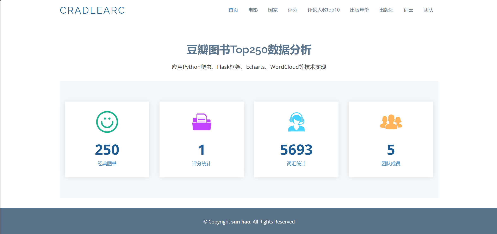
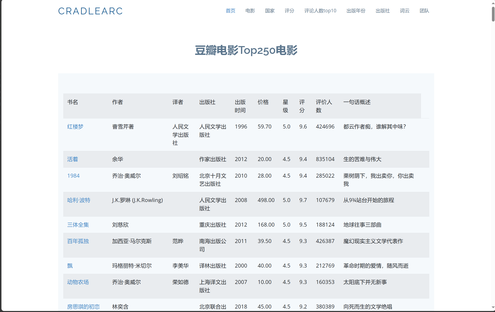

<div align="center">
<br/>
<br/>
  <h1 align="center">
    Running Spider
  </h1>
  <h4 align="center">
    爬 虫 的 入 门 级 使 用
  </h4>

<p align="center">
    <a href="#">
        
    </a>
    <a href="#">
        
    </a>
      <a href="#">
        
    </a>
</p>
</div>

<div align="center">
  
</div>

### 项目安装 

```bash
# 下 载
git clone https://github.com/CradleArc/RunningSpider
```

### 依赖环境安装

```bash
python -m venv venv

# 进入虚拟环境下
pip install -r requirements.txt
```

### 项目结构

 * 一、爬虫 (入门C级)

    技术栈：request、bs4、xlwt。

    ./dataAcq/sample.py

    功能：爬取某一网站（豆瓣电影）的前250排名数据，并把爬取数据存储在 csv 文件。


 * 二、爬虫 (入门C+级)


    技术栈：requests、xpath、pandas、WordCloud、matplotlib、jieba。
   
./dataAcq/douban_img.py

    功能：爬取某一网站（豆瓣电影）的前250排名电影数据，并存储相应的字段为csv文件和下载图片数据。

./qtTest.py

    功能：使用QT5界面搭建爬虫   

./dataAcq/dataClean.py 

    功能：清理爬取的无效数据。

./dataAcq/word.py

    功能：生成爬取数据的词云图片

 * 三、基于Flask框架搭建起来的爬虫 (进阶B级)

./app.py
   
   技术栈：mysql、flask

    功能：使用Flask搭建起爬虫数据的可视化网页

### Demo 演示

可视化主页



电影详情




